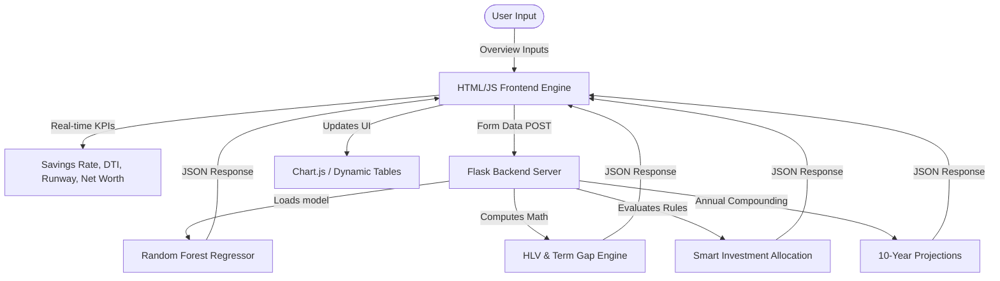

# AI Backed "Explore PM" (Portfolio Manager) Program - Comprehensive Technical Project Report & Interview Prep Guide

This master report serves as the ultimate technical brief and interview preparation guide for the **AI Backed "Explore PM" (Portfolio Manager) Program – Insurance For All** project. It details the system architecture, mathematical formulas, machine learning models, exact investment rules, user input guides, and debugging case studies.

---

## 1. Project Overview & The Elevator Pitch

**The Pitch:**
> *"AI Backed 'Explore PM' (Portfolio Manager) Program is an automated, web-based personal wealth management and predictive advisory dashboard. By analyzing a user's key financial health vitals (income, expenses, cash reserves, debt, and lifestyle risks), the system delivers real-time diagnostic metrics, budget allocations, term-insurance gap reports, smart investment strategies, and 10-year wealth projections. It combines a Machine Learning regressor (Random Forest) for expense modeling with deterministic rule engines for high-stakes financial advisory."*

---

## 2. Tech Stack Justifications (The "Why")

When asked, *"Why did you choose this tech stack?"*, use these justifications:

* **Backend: Flask (Python)**
  * *Why:* Flask is a lightweight micro-framework. It has no database overhead or rigid folder constraints, making it perfect for deploying machine learning microservices and lightweight APIs rapidly. It integrates natively with Python's scientific libraries (`pandas`, `scikit-learn`, `joblib`).
* **Machine Learning: Scikit-Learn & Joblib**
  * *Why:* Scikit-learn is the industry standard for classical ML. It provides optimized implementations of Random Forest. `joblib` was chosen over `pickle` because it is significantly faster and more efficient at loading large NumPy arrays and serialized models.
* **Data Processing: Pandas**
  * *Why:* Pandas provides the `DataFrame` structure which allows us to instantly vectorize user inputs, match feature names, and run compounding projections in milliseconds.
* **Frontend: HTML5, Vanilla CSS, and Bootstrap 5**
  * *Why:* Bootstrap 5 provides a fully responsive layout grid. Custom Vanilla CSS was used to implement advanced design aesthetics (radial gradients, glassmorphism card blur, neon borders) to create a premium, modern fintech dashboard UI.
* **Charts: Chart.js**
  * *Why:* Chart.js is a client-side canvas graphing library. It is lightweight, renders beautifully on high-DPI screens, and handles dynamic dataset mapping in real-time.

---

## 3. System Architecture & Flow



---

## 4. In-Depth Module Breakdown & Math

### Module 1: Expense Prediction
* **What it does:** Estimates a user's baseline expected monthly expenses.
* **How it works:** It uses a **Random Forest Regressor** model (`expense_predictor_rf.pkl`) trained on historical user financial records.
* **Features Used:** `Gross monthly income`, `Net monthly income`, `Savings`, `Investments`, `Debt`, `Emergency Fund`.
* **Capping Logic:** If the model predicts an expense greater than the user's Net Income, a safety cap triggers in `app.py`:
  ```python
  if predicted_expense > net_income:
      logical_expense = net_income
  ```
  This prevents unrealistic calculations and displays an alert warning the user of an overspending risk.
* **Asset Split & Future Liabilities Math:**
  * Fixed Expense = $60\%$ of predicted/capped expense.
  * Variable Expense = $40\%$ of predicted/capped expense.
  * Future EMI liability = $\text{Total Debt} / 12$ (assuming 1-year basic amortization).
  * Future Medical liability = $\text{₹1,000}$ if Age $> 50$, else $0$.
  * Future Tuition liability = $\text{₹2,000}$ if Age $< 25$, else $0$.

### Module 2: Smart Investment Advisory
* **What it does:** Recommends asset allocations based on liquidity, debt, and income levels.
* **The Rules & Trigger Logic:**
  1. **Savings Account / Liquid Fund:** Triggered if `Emergency Fund` < `3 * Monthly Expenses`.
     * *Rationale:* The primary financial rule is safety. If the user doesn't have a 3-month survival runway, they must keep cash liquid and avoid locking it up.
  2. **ELSS (Equity Linked Savings Scheme):** Triggered if emergency reserves are sufficient **AND** Liquid Savings > ₹2,00,000 **AND** Gross Monthly Income > ₹80,000 **AND** Total Debt < ₹50,000.
     * *Rationale:* High-earning individuals with low debt can afford the 3-year lock-in of ELSS to save on taxes under Section 80C and build wealth.
  3. **SIP (Systematic Investment Plan):** Triggered if emergency reserves are sufficient **AND** Liquid Savings > ₹1,00,000 **AND** Total Debt < ₹50,000.
     * *Rationale:* Moderate earners with stable savings and low debt should invest systematically in equity mutual funds to average out market volatility.
  4. **Fixed Deposit (FD) / Debt Funds:** Triggered if emergency reserves are sufficient **AND** (Gross Income < ₹40,000 **OR** Occupation in `["student", "retired", "senior citizen"]`).
     * *Rationale:* Low-income individuals, students, or retired citizens require capital preservation and fixed returns rather than equity risk exposure.
  5. **Mixed Strategy (SIP + FD):** Triggered as a fallback for general profiles.
     * *Rationale:* Divides investable surplus between equity mutual fund SIPs (for growth) and FDs/PPF (for safety and stability).

### Module 3: Insurance & Health Analytics
* **What it does:** Performs protection gap analysis and health risk scoring.
* **Human Life Value (HLV) Formula:**
  $$\text{HLV} = \text{Monthly Income} \times 12 \times \max(0, 60 - \text{Age}) \times 0.5$$
  *(Where 0.5 accounts for the reduction in personal living expenses over time).*
* **Insurance Gap Calculation:**
  * `Underinsured`: If `Current Insurance < 0.7 * HLV`.
  * `Overinsured`: If `Current Insurance > 1.2 * HLV`.
  * `Adequately Insured`: If current cover lies between 70% and 120% of HLV.
* **Health Risk Score (0-9 Scale):**
  * Age > 50: `+2` points
  * Lifestyle Score ≤ 5: `+2` points
  * Family medical history (Yes): `+3` points
  * Sedentary office occupation (IT, Developer, Admin): `+1` point
  * *Low Risk:* Score ≤ 2 | *Medium Risk:* Score 3-5 | *High Risk:* Score ≥ 6.

### Module 4: Janam Patri (Financial Projection)
* **What it does:** Projects income, expenses, and net worth growth over 1, 3, and 10 years.
* **Growth Assumptions:** Income grows at 8% p.a.; expenses grow at 6% p.a. (inflation).
* **Math Logic:**
  * **Annual Savings:** `Yearly Savings = (Net Monthly Income - Monthly Expenses) * 12`
  * **Portfolio Split:** 50% of yearly savings is added to cash savings (earning 4% interest); 50% is added to investments (earning 10% returns).
  * **Compounding Formulas:**
    $$\text{Savings}_{t} = (\text{Savings}_{t-1} \times 1.04) + \text{Savings Addition}$$
    $$\text{Investments}_{t} = (\text{Investments}_{t-1} \times 1.10) + \text{Investment Addition}$$
    $$\text{Net Worth}_{t} = \text{Savings}_{t} + \text{Investments}_{t} + \text{Emergency Fund}$$
  * **Emergency Runway Check:** If `Emergency Fund < (Monthly Expenses * 3)` in any projected year, it flags an `Emergency Fund Risk`.

---

## 5. Review of the Dataset (`Merged file.xlsx`)

* **Dataset Shape:** 148 rows and 24 columns.
* **Features:** Contains individual rows mapping user demographics (Age, Occupation), assets (Savings, Investments, Debt, Emergency Fund), and an itemized list of monthly expenses (Rent, Utilities, Insurance, Groceries, Dining out, Subscriptions, Vacations, etc.).
* **Preparation:** Columns were cleaned of whitespace, converted to numeric format, and cleaned of comma separators. The `Total Expenses` target column was calculated as the sum of all itemized expense categories.

---

## 6. Debugging Case Studies

### Case Study A: The Insurance Gap Classifier Bug
* *The Bug:* The dataset label was created using the user's `Insurance` cover, but `Insurance` was left out of the training features list for the Random Forest Classifier. The ML model tried to predict underinsurance without knowing how much insurance the user had, resulting in negative cover suggestions.
* *The Solution:* I replaced the classifier model with a deterministic HLV check directly in Python, making the calculations 100% accurate, removing the model loading overhead, and respecting the user's actual insurance input.

### Case Study B: The 12x Savings Rate Bug
* *The Bug:* The projection logic calculated `yearly_savings = income - expenses` (which are monthly figures) and added them to savings only once a year. This under-represented savings accumulation by a factor of 12.
* *The Solution:* Corrected the accumulation formula to `(income - expenses) * 12` and built in compounding rules for investments and savings.

---

## 7. Comprehensive User Input Guide & Rules of Thumb

Use this guide to explain the parameters and how they should be entered:

| Input Field | Type | Description | Financial Rule of Thumb | Example (Frugal Professional) |
| :--- | :--- | :--- | :--- | :--- |
| **Age** | Years | Earning years remaining (until 60). | Younger age gives longer compounding. | `32` |
| **Gross Monthly Income** | Monthly | Total pre-tax income. | Base cash flow metric. | `₹1,80,000` |
| **Net Monthly Income** | Monthly | Take-home pay. | Must be lower than Gross (typically 75-85%). | `₹1,45,000` |
| **Monthly Expenses** | Monthly | Regular monthly outgo. | Target to keep this under 70% of Net Income. | `₹55,000` |
| **Liquid Savings** | Balance | Immediately accessible cash. | Keep 1 to 2 months of expenses here. | `₹4,00,000` |
| **Emergency Fund** | Balance | Dedicated emergency reserve. | Must equal 3 to 6 months of expenses. | `₹2,50,000` |
| **Investments** | Balance | Market value of stocks/mutual funds. | Aim to scale to 5x-10x of annual income. | `₹8,00,000` |
| **Total Debt** | Balance | Sum of all loans. | Monthly debt EMIs should be <36% of Gross Income. | `₹40,000` |
| **Current Life Cover** | Balance | Payout amount of term plan. | Should be 10x to 15x of Annual Gross Income. | `₹2,50,00,000` |
| **Lifestyle Score** | 1 to 10 | Rating of lifestyle habits. | Under 5 increases medical risk scoring. | `8` |
| **Occupation** | Text | Current job title. | Sedentary desk jobs add to risk points. | `Software Engineer` |
| **Family Medical History** | Yes/No | Hereditary illness history. | Select "Yes" to trigger critical illness flags. | `No` |

---

## 8. Recommended Input Profiles for Verification

Use these profiles to verify the outputs of the advisory engine:

### Profile A: "The High-Earning Wealth Builder" (ELSS Recommender)
* **Inputs:** Age: `32`, Gross Income: `₹1,80,000`, Net Income: `₹1,45,000`, Expenses: `₹55,000`, Liquid Savings: `₹4,00,000`, Emergency Fund: `₹2,50,000`, Investments: `₹8,00,000`, Debt: `₹40,000`, Insurance Cover: `₹2,50,00,000`, Occupation: `Software Engineer`, Lifestyle: `8`, Family History: `No`.
* **Expected Result:**
  * **Smart Investment:** Recommends **ELSS (Equity Linked Savings Scheme)** (high savings, high income, low debt).
  * **Insurance & Health:** Marked as **Adequately Insured** (HLV is ~₹3 Crore, ₹2.5 Crore cover is well within the 70% boundary). Health risk is marked as **Low**.

### Profile B: "The Under-Prepared Spender" (Vulnerable Reserves & Underinsured)
* **Inputs:** Age: `42`, Gross Income: `₹80,000`, Net Income: `₹68,000`, Expenses: `₹60,000`, Liquid Savings: `₹20,000`, Emergency Fund: `₹15,000`, Investments: `₹30,000`, Debt: `₹4,50,000`, Insurance Cover: `₹10,00,000`, Occupation: `Office Administrator`, Lifestyle: `4`, Family History: `Yes`.
* **Expected Result:**
  * **Smart Investment:** Recommends **Savings Account / Liquid Fund** because the emergency reserve (₹15,000) is far below the required 3-month runway (₹1,80,000). High-debt warning displays.
  * **Insurance & Health:** Marked as **Underinsured** (HLV is ~₹86 Lakhs; current cover is only ₹10 Lakhs, leaving a ₹76 Lakh gap). Health risk is marked as **High** due to low lifestyle score and family history.

### Profile C: "The Conservative Student" (Capital Preservation)
* **Inputs:** Age: `21`, Gross Income: `₹20,000`, Net Income: `₹18,000`, Expenses: `₹10,000`, Liquid Savings: `₹35,000`, Emergency Fund: `₹10,000`, Investments: `₹5,000`, Debt: `₹0`, Insurance: `₹0`, Occupation: `Student`, Lifestyle: `9`, Family History: `No`.
* **Expected Result:**
  * **Smart Investment:** Recommends **Fixed Deposit (FD) / Debt Funds** (low income, student status).
  * **Overview Hub:** High Savings Rate (~44%) and safe green metrics display.

---

## 9. Technical Q&A Cheatsheet

### Q1: "Why did you use Random Forest instead of a neural network?"
> *"For tabular financial data with a small sample size (148 rows), deep learning models overfit and are computationally expensive. Random Forest is an ensemble tree algorithm that excels at finding non-linear relationships in tabular datasets, resists overfitting, and requires zero feature scaling."*

### Q2: "What is the difference between Savings and Emergency Fund?"
> *"Savings represents discretionary liquid cash used for short-term goals. An Emergency Fund is a dedicated reserve strictly meant to cover basic survival expenses for 3 to 6 months in case of job loss or emergency. Mixing them can lead to liquidity crises."*

### Q3: "Why does the projection table show 'Emergency Fund Risk' in Year 10?"
> *"Because while the emergency fund is static, inflation grows the user's monthly expenses by 6% every year. By Year 10, the monthly expenses have increased so much that the static emergency fund no longer covers the required 3-month survival runway."*

### Q4: "How does the budget allocator progress bar work?"
> *"The allocator uses net income to set 50/30/20 target budgets. The progress bars dynamically track the user's actual expenses against these target thresholds. If actual expenses exceed the 50% target, the progress bar fills up, warning the user of cash flow overexposure."*
